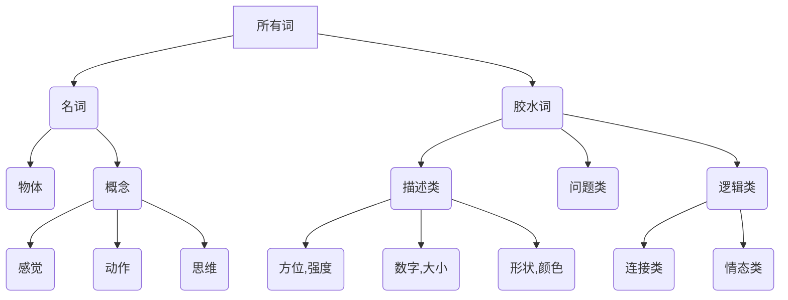
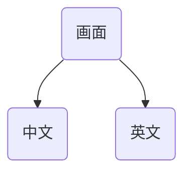

语言：声音和符号代表具体意思

### 一、方法

***

1. 停止用错误的方法
2. 开始正确的方法
3. 建立准确的习惯
4. 利用合适的工具和环境
5. 心理状态管理
6. 投资足够的时间

### 二、下意识

***

* 不要刻意强迫自己
* 保持轻松快乐的状态
* 80%放在理解和输入
* 相信自己的最初意识

### 三、建立信息网

***

* 先建立和谐词汇并熟练应用，随之给大脑建立信息网，围绕核心词汇进一步扩大词汇量

### 四、明确目标

***

* 树立一个良好的学习英语的长期目标
* 切分成里程碑式的小目标
* 每天会一些，有积累的感觉

### 五、成年人的优势

***

* 优势
  * 已经认识了世界，不需要掌握很多的概念
  * 对语言的概念和基本规律有深厚的认识
  * 有不同的工具或者技巧来学习
* 发挥优势
  * 进行深度处理
  * 利用自己已经回到信息提高理解力和学习速度
  * 利用已有的认知加深理解
  * 用语法表格建立宏观的认识
  * 适当地做笔记记录知识点

### 六、关于上课

***

* 学习误解
  * 教 != 学
  * 知道 != 会， 要多练

* 教程选择
  * 微课程
  * 音频和视频资料为主作为输入
  * 可以理解的内容和有效的过程
  * 中英对照学习内容
  * 大脑学习状态的辅导（鸡汤少不了～）
  * 学习时候的音乐
  * 利用移动设备随时随地地学习

### 七、习惯的培养

***

* 从一个习惯递增到多个习惯，用这些习惯来支持英语学习（其他的学习也类似）
  * 习惯一： 每天听英语，培养语感，建立听英语的习惯（可可英语这个app不错）
  * 习惯二：培养英语思维，习惯与用英语去表达见到的事物
  * 习惯三：hear how it feels，feel how it sounds，说英语的过程中，注意嘴巴里的感觉，通过感觉强化自身口语的能力。
  * 习惯四：注意内心的画面，建立画面联系：看画面想到英语表达，看英语想画面呈现
  * 习惯五：自言自语，词-->短语-->句子 来描述你周围的环境，在这个基础上做场景对话
  * 习惯六：玩词，牢固英语信息网，熟悉英语语感并逐渐掌握英语语法
  * 习惯七：英语真实沟通，找个环境或者app等
  * 习惯八：英语44个发音练习
  * 习惯九：英语文字沟通
  * 习惯十：影子跟读，矫正方法

### 八、万能钥匙

***

* skeleton key

```
How do you say this?
What is this called?
Please say that again.
Please speak more slowly.
I don`t understand.
```

* 学习要点
  * 不需要分解单词
  * 掌握一句话整体含义
  * 马上去用就可以
  * 高频小词 27 个

| yes       | I    | Me   | Give | This  | What  |
| --------- | ---- | ---- | ---- | ----- | ----- |
| No        | You  |      | Want | That  | Where |
| Please    | He   | Him  | Is   | Here  | Who   |
| Thank you | She  | Her  | Are  | There | When  |
|           | They | Them |      |       | Why   |
|           | It   |      |      |       |       |

* 总结：注意力不要放在语法上，先懂得如何让自己开口说英语

### 九、两类词

***




### 十、名词-胶水词(70个)

***

* 物体--Thing

```
What is this thing?
How do you say this thing.
I want that thing.
Give me that thing there.
Whose is this thing?
Do you want this thing?
Please bring that thing here!
```

* 方位表达

  * Top -- bottom  

  * left -- right 

  * front -- behind 

  * inside--outside

* 大小
  * big -- small
  * Tall - short
  * Long
* 颜色
  * red green black orange bule white purple grey yellow
* 逻辑类
  * 链接类
    * so / because / and / but / although / however
  * 情态类
    * can / can't / should / should't / must / sometimes / never / always

### 十一、[SameBox-DifferencePath](https://www.bilibili.com/video/BV1BW411y7fj?p=20)

***

* 直接建立联系



* 词--短语--句子
  * 先学具体的东西-名词-动词
  * 把词组变成画面
  * 把语法画面化
  * 增加比喻

### 十二、从听开始

***

* 核心器官：耳朵、嘴巴、大脑
  * 建立英语声音过滤系统
  * 练好面部肌肉
  * 声音和画面和感觉建立连接
  * 自己的反应自动化

* 听-->说-->读-->写

### 十三、[可理解输入](https://www.bilibili.com/video/BV1BW411y7fj?p=22)

***

* 感官输入
  * 视觉 / 听觉 / 感觉 / 嗅觉 / 味觉
  * 语言
* 观察声音
  * <font color=red> **把声音和东西关联起来，(这个东西的发音是这个，啥语言不重要，要学会这个声音，理解后输入)，声音和符号代表的物体**</font>
* 观察动作
  * 动作理解含义，下意识获取含义，然后听懂这个发音代表的是什么，然后会使用，

* 如何把声音变成可理解输入
  * 观察场景里的所有信息
  * 把场景的含义沉淀出来
  * 听词的时候，把它当作整个场景之上多一条信息线路
  * 记住这些声音并且把场景的含义融成一体
* <font color=red> **同时输入两种模式的对照，多听几遍，有效输入，提升画面对照比例，逐步培养，找规律**</font>

### 十四、词组

***

* 词组含义的记忆

### 十五、记忆

***

* 记忆是否丰富，多器官的记忆，情感的参与，多深度参与
* 注重每个词的感觉、情感、参与
* 记忆钩子，辅助深度参与

### 十六、语法

***

* 用词顺序
* 多度含义
  * 增度含义 to/from/the/a
  * 变形词(变声词) i/me
  * 逻辑词(胶水词) although，but，and
  * 词粒子  -ing，-ed，-ly，-ness等

